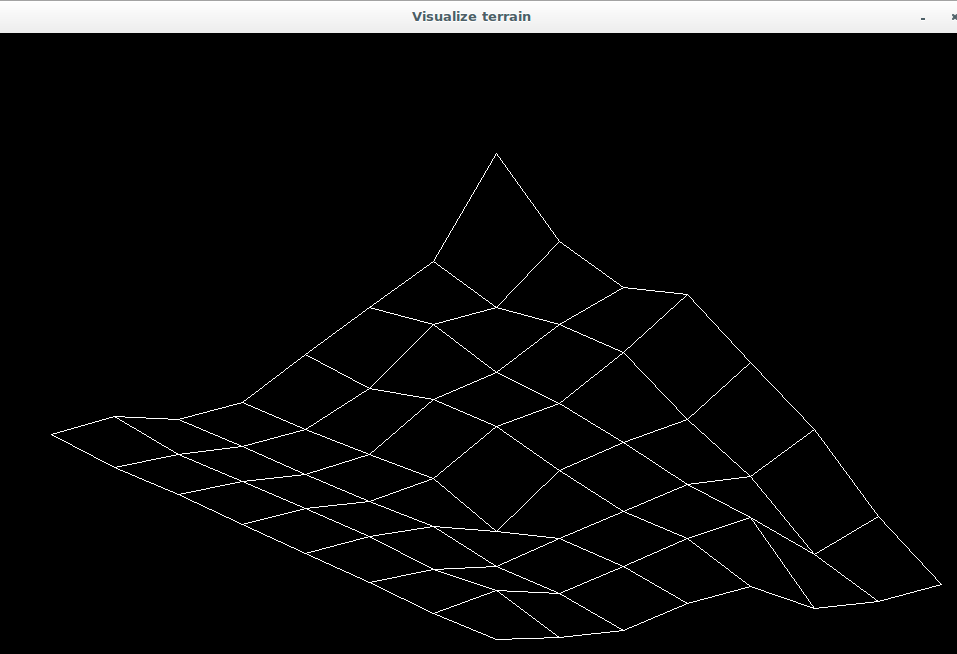
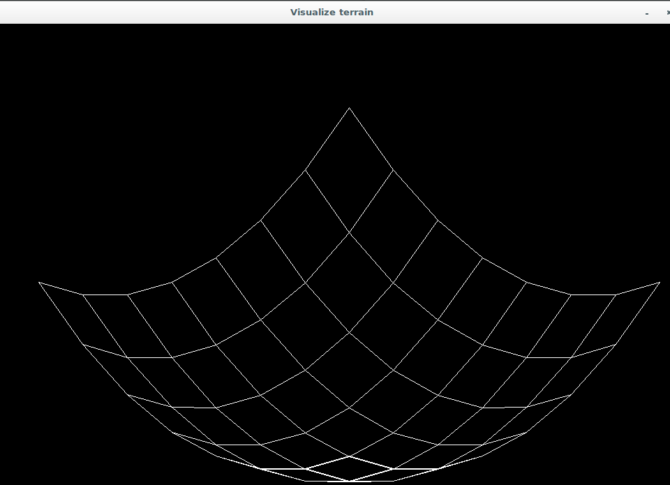

# 3D-projection

This program is written in a c using SDL2 and can help you visulaize a set of data in 3D.
The file containing the data should be in the form of a matrix.
The columns represnt the x values, the rows represent the y values, and the actual values
represent the z values.

For example, the following altitude data would give the figure below
```

120 60 40 60 20 -20 -80 -120
40 20 30 30 -10 -40 -90 -110
20 30 10 06 -6 -20 -26 -90
00 -6 10 10 -6 -20 -20 -40
-20 -20 -18 -14 -40 -20 -20 -30
-10 -10 -10 -10 -8 -20 -20 -30
20 10 10 10 10 04 10 -10
30 24 24 22 20 18 14 16

```

In these data, `120` is the value of `z` at `x = 0`, and `y = 0`.
And these is what the graph looks like,



## Other examples




## Files 
[graphic_utils.c](./graphic_utils.c) -  all the utilites related to graphic rendering in SDL, like draw grid and transform grid which draws grid and transforms grid respectively.
[init.c](./init.c) - This is where the functions related to opening and closing SDL windows defined
[loader.c](./loader.c) - This is where the functions for loading and parsing the data form file are defined
[README.md](./README.md) - This is the readme fiel you currenlty are reading 
[terrain.c](./terrain.c) - This is the main entry point of the program
[terrain.h](./terrain.h) - This is where all the prototypes are defined
[tests/](./tests) - this is where all the files related to testing located including the images in these readme
[utils.c](./utils.c) -  This are utilites besides the one that are realted to SDL

## Usage

To use these program, after installing (installation guide is in the below section) with 
the name terrain. you can run it like 
./terrain altitude_file
where altitude_file is the file containing data like the above.

## Installation
To install you will first need to install the SDL2 liberary on your machine. The installetion guides are
only for `*nix`.

First clone this repository to your local machine,
```
git clone https://github.com/hileamlakB/Raise_the_terrain.git
```
Then 

```
cd Raise_the_terrain

```
After that compile the source code with the following command
```
gcc -Wall -pedantic -Werror -Wextra -lSDL2 -lm -o terrian

``` 
Finally you can run it like
```
./terrain alttude_file
```

## Author
Hileamlak M. Yitayew <br>
@hileamlakb

